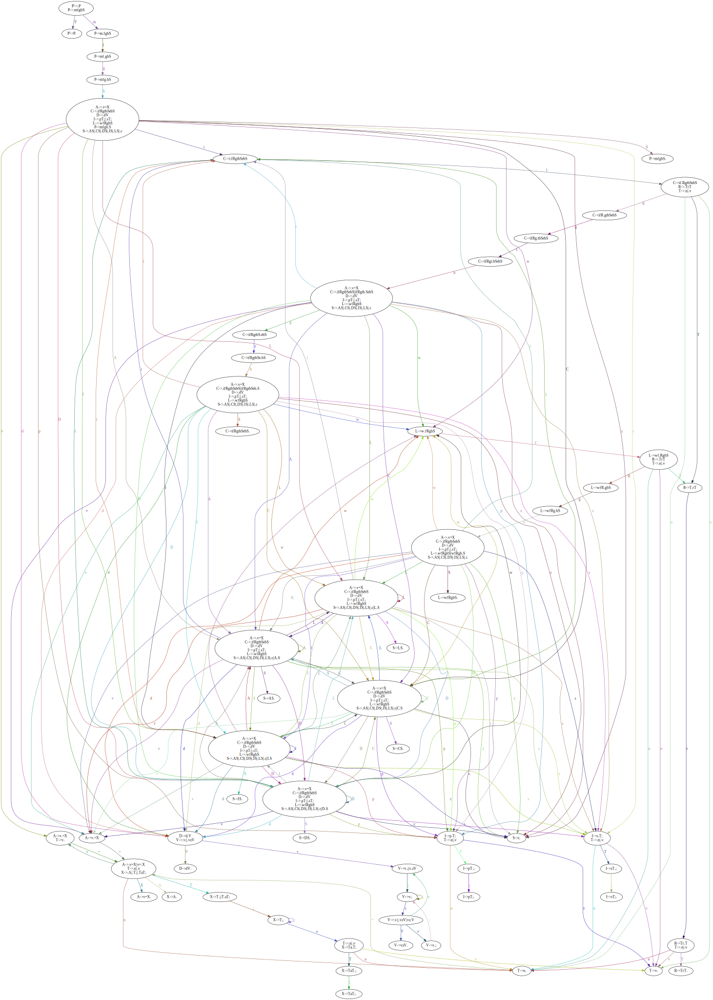

# basic-gcc-like-compiler

Designing a C like compiler

## File Structure

-   `grammar` - Grammar rules and descriptions
-   `lexer` - Lex file. Reads the input and writes the tokens to `out/lex/<input filename>.tkl`
-   `parser` - Parser program files
-   `results` - Parsing table, Transition graph, Graph visualization
-   `symbol table` - Symbol table generating program and writes the tokens to `out/symbol table/<input filename>.csv`
-   `util` - Utility Cpp program to prepare for read and write to files
-   `out` - Output files from the lexer, parser, and symbol table

## Transitions

